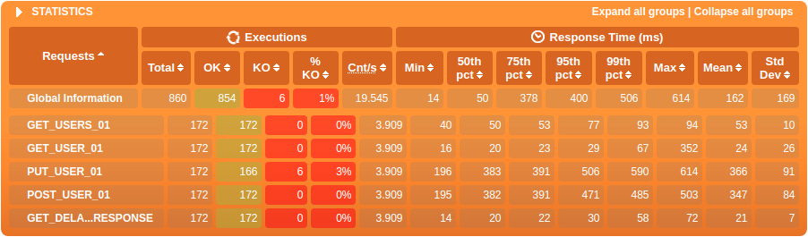
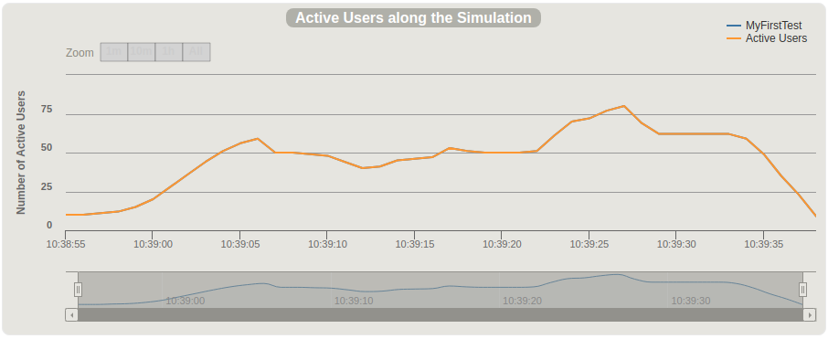

# Simulações em Gatling

## **Imports**

No Gatling, para se utilizar da DSL é necessário fazer alguns imports:

```Scala
import scala.concurrent.duration._ /* para especificar a grandeza na duração de tempo */

import io.gatling.core.Predef_ /* core para a DSL */
import io.gatling.http.Predef_ /* protocolo http */
import io.gatling.jdbc.Predef_ /* caso utilize feeder */
```

## **Estrutura**

A classe de teste precisa estender a classe Simulation que é estruturada em 4 partes:

### **HTTP Protocol**

O Gatling HTTP faz com que seja possível utilizar o protocolo HTTP para realizar os testes que podem ser aplicados em APIs, sites e web services. Utilizando `http.baseUrl()` setamos o **httpProtocol** para o nosso scenario. Vale ressaltar que também é possível realizar o teste em vários alvos ao mesmo tempo utilizando o `http.baseUrls()`.

No nosso caso, o teste foi aplicado na API [Reqres](https://reqres.in/):

```Scala
val httpProtocol = http.baseUrl("https://reqres.in")
```

O protocolo também nos permite várias outras configurações desde whitelists, blacklists e headers.

### **Headers**

Pode-se definir um header específico para cada request. Os headers em gatling suportam as configurações dos headers no protocolo HTTP, como o accept-language, referer, Do Not Track, content-type, etc.

O nosso teste é de cunho didático então não é preciso um header muito complexo:

```Scala
val header = Map(
    "content-type" -> "application/json"
)
```

### **Scenario**

Aqui é onde vai ser definido um cenário de teste que contém os requests que são enviados através do método `.exec(http(requestName: String).request)` e que geralmente é seguido por um `.pause()` que pode simular o tempo que um usuário levaria para realizar outro request ou também pode ser utilizado para organização e legibilidade do teste. Definimos um scenario **MyFirstTest**:

```Scala
val scn = scenario("MyFirstTest")
```

No exec está contido o nome do request e o próprio request que, por sua vez, contém o método e a URL. O próprio gatling provém os métodos mais comuns como os utilizados em REST: get, put, post, delete, patch.

#### **Get**

```Scala
.exec(http("GET_USERS_01")
    .get("/api/users?page=2")
    .headers(header))
.pause(2)
```
#### **Post**

O gatling também dá suporte à passagem de parâmetros para os métodos que necessitam de um, como o post. Uma forma de fazer isso é usando o `.formParam(“key”, “value”)`:

```Scala
.exec(http("POST_VALUE")
    .post("my.form-action.uri")
    .formParam("myKey", "myValue"))
.pause(2)
```

Também é possível adicionar um corpo ao request utilizando o `.body()` e assim passar um arquivo ou objeto JSON por parâmetro:

```Scala
.exec(http("POST_USER_01")
    .post("/api/users")
    .body(StringBody("""{ "name": "morpheus", "job": "leader" }""")).asJson
    .check(status.is(201)))
.pause(2)
```

Utilizando o **StringBody** passa-se uma string por parâmetro mas também é possível passar diretamente um arquivo utilizando o **RawFileBody**, no caso do JSON `.body(RawFileBody(“object.json”)).asJson`. No caso do bundle baixado no gatling.io, o arquivo .json precisa estar dentro da pasta `user-files/resources`.

#### **Put**

```Scala
.exec(http("PUT_USER_01")
    .put("/api/users/2")
    .body(StringBody(s""" {"name": "morpheus", "job": "zion resident", "updatedAt": "${java.time.LocalDate.now}" } """))
    .check(status.is(200)))
.pause(2)
```

### **Simulation**

Aqui é onde a simulação é definida, é informada a quantidade de usuários a serem injetados no scenario e a frequência com que estes usuários são injetados. Para isso, o gatling provém alguns métodos para auxiliar na tarefa:

* **`atOnceUsers(nUsers)`**: Inejta nUsers de uma única vez.

* **`nothingFor(duration)`**: Não faz nada durante **duration**.

* **`constantUsersPerSec(rate) during(duration)`**: Injeta **rate** usuários por segundo durante **duration**.

* **`constantUsersPerSec(rate) during(duration) radomized`**: Injeta **rate** usuários durante **duration**, mas a injeção é feita em intervalos aleatórios.

* **`rampUsers(nUsers) over(duration)`**: Injeta **nUsers** de maneira constante e distribuida dentro de **duration**.

* **`rampUsersPerSec(rate1) to (rate2) during(duration)`**: Adiciona de **rate1** à **rate2** usuários por segundo de forma não-constante, mantendo a rampa de usuários, durante **duration**.

* **`rampUsersPerSec(rate1) to (rate2) during(duration) randomized`**: Adiciona de **rate1** à **rate2** usuários de forma não-constante e mantendo a rampa de usuários. A injeção de usuários ocorre em intervalos aleatórios e dura **duration**.

* **`heavisideUsers(nUsers) during(duration)`**: Injeta **nUsers** de forma a simular melhor um pico real de usuários.

Setamos uma simulação simples:

```Scala
setUp(scn
    .inject(
        atOnceUsers(10),
        nothingFor(3 seconds),
        heavisideUsers(50) during(10 seconds),
        nothingFor(5 seconds),
        constantUsersPerSec(10) during(5 seconds),
        nothingFor(5 seconds),
        rampUsersPerSec(10) to 15 during(5 seconds)
    ))
    .protocols(httpProtocol)
```

#### **Concurrent scenarios**

É possível executar 2 ou mais scenarios de maneira concorrente:

```Scala
setUp(
  scenario1.inject(injectionProfile1),
  scenario2.inject(injectionProfile2)
)
```

#### **Sequential Scenarios**

Utilizando o método `andThen()`, é possível definir um scenario filho que vai executar após o término do seu scenario pai.

```Scala
setUp(
  parent.inject(injectionProfile)
    .andThen(
      child1.inject(injectionProfile)
        .andThen(grandChild.inject(injectionProfile)),
      child2.inject(injectionProfile)
    )
)
```

#### **Throttling**

Quando para o teste é mais importante lidar com requests por segundo do que usuários simultâneos, se torna interessante de utilizar o throttling. Utilizando o método `throttle`, o gatling possui alguns métodos que auxiliam a manipular os requests:

* **`reachRps(target) in (duration)`**: A simulação atinge **target** requests em rampa durante **duration**.
* **`jumpToRps(target)`**: Vai imediatamente para **target** requests.
* **`holdFor(duration)`**: Mantém os requests por segundo durante **duration**.
  
```Scala
setUp(scn.inject(constantUsersPerSec(100) during (30 minutes))).throttle(
    reachRps(100) in (10 seconds),
    holdFor(1 minute),
    jumpToRps(50),
    holdFor(2 hours)
)
```

#### **Maximum duration**

Utilizando `maxDuration` a simulação é forçada à encerrar independentemente de qualquer coisa.

```Scala
setUp(scn.inject(rampUsers(1000) during (20 minutes))).maxDuration(10 minutes)
```

## **Checks e Assertions**

### **Checks**

Check geralmente é utilizado para verificar se a resposta de um request é a esperada. É dividida em uma sequência de passos.

#### **Type**

* **HTTP status:** `status` aplica o check no código de resposta HTTP que o request resultou.
  
* **Page location:** `currentLocation` e `currentLocationRegex()`, o primeiro aplica o check na URL da página atual, o segundo faz o mesmo mas pesquisa a ocorrência de um padrão que é passado por parâmetro.

* **HTTP header:** `header()` e `headerRegex()`, o primeiro aplica o check no header passado por parâmetro, o segundo faz o mesmo mas pesquisa a ocorrência de um padrão que é passado por parâmetro juntamente com o nome do header.

* **HTTP response body:** Utilizando métodos que o próprio gatling fornece como `bodyString`, `bodyBytes` e `bodyStream`, é possível aplicar alguns checks no corpo de resposta HTTP que o request resultou.

#### **Extracting**

Usado para extrair ocorrências dos targets que foram setados no passo de definição de tipo do check. Alguns métodos do extracting:

* **`find`**: retorna a primeira ocorrência.
* **`findAll`**: retorna todas as ocorrências em uma lista.
* **`findRandom`**: retorna uma ocorrência aleatória.
* **`findRandom(n: Int)`**: retorna n ocorrências aleatórias.

#### **Validating**

Usado para uma validação do check, algumas validações do gatling:

* **`is(expected)`**: Valida se o valor retornado é igual ao parâmetro **expected**.
* **`not(expected)`**: Valida se o valor retornado é diferente do **expected**
* **`isNull`**: Valida se o valor retornado é **NULL**.
* **`notNull`**: Valida se o valor retornado é diferente de **NULL**.
* **`exists`**: Valida se o valor retornado existe.
* **`notExists`**: Valida se o valor retornado existe.

#### **Conditional Checking**

**`checkIf(condition)(thenCheck)`**: O check fica dependente de uma condição para ocorrer.

#### **Realizando o Check**

Para realizar o check, juntamos todos os passos acima e assim formamos o check:

```Scala
/* O check valida se o código de resposta recebido é igual à 200 */
.check(status.is(200)))

/* O ckeck valida se o código de resposta recebido está entre 200 e 205 */
.check(status.in(200 to 2010))

/* O check valida se tiver 1 ocorrência de "aWord" */
regex("aWord").find.exists

/* O check valida se não tiver nenhuma ocorrência de "aWord" */
regex("aWord").find.notExists

/* O check valida se o conteúdo entre response body e o expected.json for verdadeira */
bodyBytes.is(RawFileBody("expected.json"))
```

Para mais funcionalidades e exemplos, acessar a [documentação](https://gatling.io/docs/current/http/http_check/).

### **Assertions**

Assertions são utilizados para afirmar os requests baseados em estatísticas como seu tempo de resposta ou total de falhas. Igualmente ao Check, um assertion em gatling é definido em uma sequência de passos.

#### **Scope**

Aqui é definido o escopo em que o assertion vai atuar:

* **`global`**: O assertion se baseia nas estatísticas de todos os requests.
* **`forAll`**: O assertion se baseia nas estatísticas de cada request individualmente.
* **`details(path)`**: O assertion se baseia nas estatísticas de um request ou um grupo de requests em específico. 

#### **Statistics**

Define qual estatística o assertion vai se basear:

* **`responseTime`**: O assertion vai utilizar o tempo de resposta em millisegundos.
* **`allRequests`**: O assertion vai utilizar o número total de requests.
* **`failedRequests`**: O assertion vai utilizar o número de requests que falharam. 
* **`successfulRequests`**: O assertion vai utilizar o número de requests que tiveram sucesso. 
* **`requestPerSec:`**: O assertion vai utilizar a taxa de requests por segundo.

#### **Metric**

Define qual a métrica que o assertion vai utilizar, algumas métricas do gatling:

##### **Response time**

* **`min`**: O assertion afirma na menor métrica possível.
* **`max`**: O assertion afirma na maior métrica possível.
* **`mean`**: O assertion afirma na média entre a maior e menor métrica possível.
* **`stdDev`**: O assertion afirma no desvio padrão da métrica.
* **`percentile(per: Double)`**: O assertion afirma na porcentagem passada por parâmetro.

##### **Number os requests**

* **`percent`**: Usa o número de requests como uma porcentagem.

#### **Condition**

Define quais condições serão aplicadas à métrica, as condições podem ser combinadas em cadeia. Algumas condições do gatling:

* **`lt(limite)`**: Verifica se o valor da métrica é menor que o limite passado no parâmetro.
* **`lte(limite)`**: Verifica se o valor da métrica é menor ou igual ao limite. 
* **`gt(limite)`**: Verifica se o valor da métrica é maior que o limite.
* **`gte(limite)`**: Verifica se o valor da métrica é maior ou igual ao limite.
* **`between(limMin, limMax)`**: Verifica se o valor da métrica está no intervalo entre limMin e limMax, incluindo os limites.
* **`is(value)`**: Verifica se o valor da métrica é igual à **value** 
* **`in(sequence)`**: Verifica se o valor da métrica está presente na sequência passada por parâmetro. 

#### **Realizando o Assertion**

De maneira similar ao Check, temos o assertion ao juntarmos todos os passos acima:

```Scala
/* Afirma se todos os requests têm o tempo de resposta menor do que 50ms */
setUp(scn).assertions(global.responseTime.max.lt(50))

/* Afirma se todo request têm menos do que 5% de falhas */
setUp(scn).assertions(forAll.failedRequests.percent.lte(5))

/* Afirma se todo request têm pelo menos 95% de sucessos */
setUp(scn).assertions(forAll.successfulRequests.percent.gte(95))
```
Setamos um assertion simples, combinando com o nosso inject:

```Scala
setUp(scn
    .inject(
        atOnceUsers(10),
        nothingFor(3 seconds),
        heavisideUsers(50) during(10 seconds),
        nothingFor(5 seconds),
        constantUsersPerSec(10) during(5 seconds),
        nothingFor(5 seconds),
        rampUsersPerSec(10) to 15 during(5 seconds)
    ))
    .assertions(
        forAll.responseTime.max.lte(150),
        global.successfulRequests.percent.gte(95)
    )
    .protocols(httpProtocol)
```

#### **Resultados**

Quando uma simulação utiliza assertions, os resultados do assertion são escritos em um arquivo JSON e em outro JUnit. Caso utilizado o bundle do gatling, os arquivos de report estarão dentro da pasta `results/YorSimulationResult/js`.

Ex:
```javascript
/* Exemplo tirado do arquivo assertions.json do MyFirsTest */

/* ... */

"assertions": [
{
  "path": "GET_USERS_01",
  "target": "max of response time",
  "condition": "is less than or equal to",
  "expectedValues": [150.0],
  "result": false,
  "message": "GET_USERS_01: max of response time is less than or equal to 150.0",
  "actualValue": [247.0]
},
{
  "path": "GET_DELAYED_RESPONSE",
  "target": "max of response time",
  "condition": "is less than or equal to",
  "expectedValues": [150.0],
  "result": true,
  "message": "GET_DELAYED_RESPONSE: max of response time is less than or equal to 150.0",
  "actualValue": [83.0]
},
{
  "path": "Global",
  "target": "percentage of successful events",
  "condition": "is greater than or equal to",
  "expectedValues": [95.0],
  "result": true,
  "message": "Global: percentage of successful events is greater than or equal to 95.0",
  "actualValue": [98.95348837209302]
}
  ]

/* ... */
```
Para mais funcionalidades e exempos, acessar [documentação](https://gatling.io/docs/current/general/assertions/).

## **Geração de relatório**

### **Relatório via terminal**

O gatling automaticamente gera relatórios detalhados sobre as simulações executadas, as estatísticas da simulação são atualizadas no terminal a cada 5s de execução:

```console
================================================================================
2020-11-27 10:39:35                                          40s elapsed
---- Requests ------------------------------------------------------------------
> Global                                                   (OK=833    KO=6     )
> GET_USERS_01                                             (OK=172    KO=0     )
> GET_USER_01                                              (OK=172    KO=0     )
> PUT_USER_01                                              (OK=166    KO=6     )
> POST_USER_01                                             (OK=172    KO=0     )
> GET_DELAYED_RESPONSE                                     (OK=151    KO=0     )
---- Errors --------------------------------------------------------------------
> status.find.is(200), but actually found 503                         6 (100,0%)

---- MyFirstTest ---------------------------------------------------------------
[#####################################################---------------------] 72%
          waiting: 0      / active: 47     / done: 125   
================================================================================
```

* De início tem-se a data, hora e tempo de execução atual.
* Na parte de **Requests** é exibido em escopo global quantos requests deram OK e quantos deram KO, logo abaixo é exibido o mesmo para cada request individualmente.
* Na parte de **Errors** é exibido os checks que não foram validados.
* Por último é exibido a progressão atual do teste em porcentagem, logo abaixo também é exibido algumas informações sobre os usuários injetados.

Ao finalizar o teste, o gatling exibe algumas estatísticas gerais sobre a simulação:

```console
Simulation reqres.MyFirstTest completed in 43 seconds
Parsing log file(s)...
Parsing log file(s) done
Generating reports...

================================================================================
---- Global Information --------------------------------------------------------
> request count                                        860 (OK=854    KO=6     )
> min response time                                     14 (OK=14     KO=210   )
> max response time                                    614 (OK=614    KO=391   )
> mean response time                                   162 (OK=161    KO=356   )
> std deviation                                        169 (OK=169    KO=65    )
> response time 50th percentile                         50 (OK=50     KO=385   )
> response time 75th percentile                        378 (OK=378    KO=388   )
> response time 95th percentile                        400 (OK=401    KO=390   )
> response time 99th percentile                        506 (OK=506    KO=391   )
> mean requests/sec                                 19.545 (OK=19.409 KO=0.136 )
---- Response Time Distribution ------------------------------------------------
> t < 800 ms                                           854 ( 99%)
> 800 ms < t < 1200 ms                                   0 (  0%)
> t > 1200 ms                                            0 (  0%)
> failed                                                 6 (  1%)
---- Errors --------------------------------------------------------------------
> status.find.is(200), but actually found 503                         6 (100,0%)
================================================================================

Reports generated in 0s.
Please open the following file: /home/rennan/Área de Trabalho/gatling-charts-highcharts-bundle-3.4.1/results/myfirsttest-20201127133853743/index.html
GET_USERS_01: max of response time is less than or equal to 150.0 : true
GET_USER_01: max of response time is less than or equal to 150.0 : false
PUT_USER_01: max of response time is less than or equal to 150.0 : false
POST_USER_01: max of response time is less than or equal to 150.0 : false
GET_DELAYED_RESPONSE: max of response time is less than or equal to 150.0 : true
Global: percentage of successful events is greater than or equal to 95.0 : true
```

* **request count**: Quantidade total de requests executados na simulação.
* **min response time**: Menor tempo de resposta em um request.
* **max response time**: Maior tempo de resposta em um request.
* **mean response time**: Tempo médio de resposta dos request.
* **std deviation**: Desvio padrão.
* **response time nth percentile**: Tempo de resposta em uma progressão de n% da simulação.
* **mean requests/sec**: Média de requests por segundo.

Após as estatísticas globais o gatling também informa os assertions que foram validados, no nosso caso houveram 3 casos que não foram validados pois os requests tiveram o tempo de resposta maior do que 150ms.

## **Relatório index.html**

O gatling também gera um arquivo html que detalha todo o relatório da simulação de forma visual.

<p align="center">
  
  
  
  
  
</p>

Além de detalhar visualmente as informações do relatório do terminal, no index.hmtl o gatling também gera gráficos com informações sobre usuários ativos durante a simulação (abaixo), requests por segundo, respostas por segundo, entre outros.

<p align="center">
  
</p>

## **Referências**

* [Documentação Gatling](https://gatling.io/docs/current/)
* [Gatling Tutorials for Beginners by James Willet](https://www.youtube.com/watch?v=6Uc--YQMwf4&list=PLw_jGKXm9lIYpTotIJ-R31pXS7qqwXstt)
* [Testes de carga e performance com Gatling.io – Eduardo Costa](https://www.youtube.com/watch?v=-tk24HMG41g)
* [Gatling Load Testing Part 1 – Using Gatling](https://blog.codecentric.de/en/2017/06/gatling-load-testing-part-1-using-gatling/)
* [Performance Testing Framework with Gatling and Maven](https://devqa.io/gatling-maven-performance-test-framework/)
